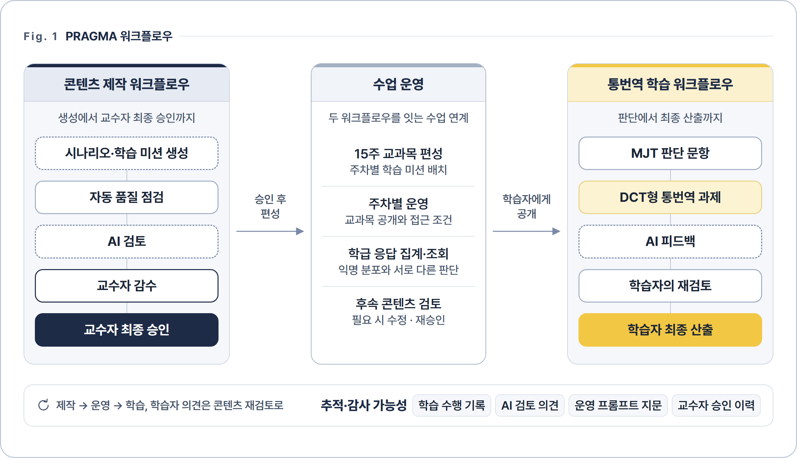
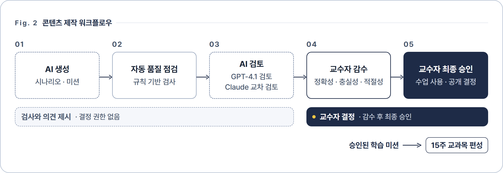
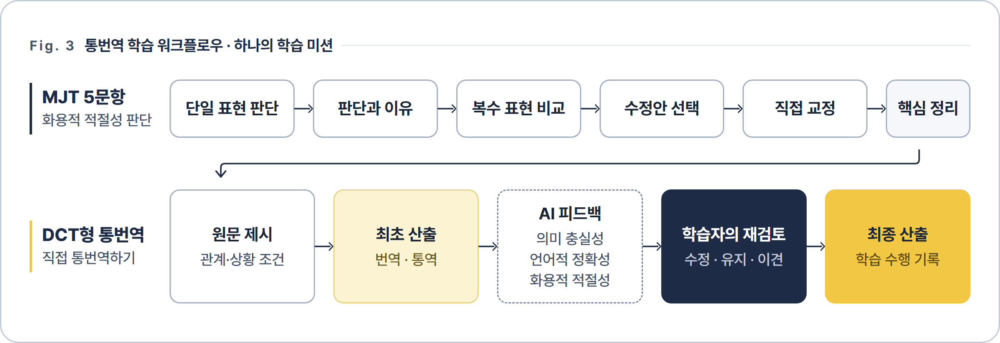
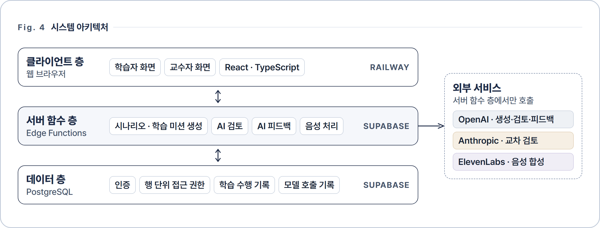

  

  
  

<h3 align="center">같은 뜻도, 관계와 상황에 따라 다르게 표현합니다.</h3>

PRAGMA는 화용적 적절성을 중심으로 설계한 한·중 통번역 학습 플랫폼입니다. 
학습자는 원문의 의미와 화행 목적을 유지하며 관계·상황에 맞게 통번역합니다.

 

<table>
  <thead><tr><th width="264" align="left">확인할 내용</th><th width="297" align="left">바로가기</th></tr></thead>
  <tbody>
    <tr><td>🖥️ 웹앱</td><td><b><a href="https://pragma.up.railway.app">pragma.up.railway.app</a></b></td></tr>
    <tr><td> PRAGMA 워크플로우 전체 구조</td><td><a href="https://pragma.up.railway.app/architecture">pragma.up.railway.app/architecture</a></td></tr>
    <tr><td> 대표 학습 미션</td><td><a href="https://pragma.up.railway.app/demo/mission">pragma.up.railway.app/demo/mission</a></td></tr>
    <tr><td>📑 학위논문 장절별 구현 위치</td><td><a href="#6-학위논문과-구현의-대응">6. 학위논문과 구현의 대응</a></td></tr>
  </tbody>
</table>

> <small>PRAGMA의 설계 원리가 실제로 작동하는 코드와 그 개발 과정 전체를 공개합니다.</small>

 

## 1. PRAGMA 워크플로우

> <small>AI 콘텐츠 제작에서 학습자의 최종 산출까지를 하나의 워크플로우로 설계·구현했습니다.</small>

 

## 2. 콘텐츠 제작 워크플로우

> <small>AI가 생성·검토하고 교수자가 최종 승인하는, 인간-AI 협업형 콘텐츠 품질 관리 체계입니다.</small>

 

## 3. 통번역 학습 워크플로우

- **학습 미션**은 MJT 5문항과 DCT형 통번역 과제 1개로 구성됩니다.
- **MJT 문항**에서는 제시된 표현을 판단·선택·교정합니다.
- **통번역 과제**에서는 별도의 원문을 번역 또는 통역합니다.
- **AI 피드백**은 채점이 아니며, 최종 산출은 학습자가 결정합니다.

 

## 4. 학습 미션의 생성 조건

<table>
  <thead><tr><th width="180" align="left">조건</th><th width="492" align="left">구성</th></tr></thead>
  <tbody>
    <tr><td>목표 화행</td><td>요청&emsp;거절&emsp;사과&emsp;감사&emsp;불만&emsp;칭찬&emsp;초대&emsp;제안&emsp;반대</td></tr>
    <tr><td>관계·상황</td><td>상대적 권력(P) · 사회적 거리(D) · 행위 부담도(R)</td></tr>
    <tr><td>언어 방향</td><td>한→중 · 중→한</td></tr>
    <tr><td>수행 방식</td><td>번역 · 통역</td></tr>
    <tr><td>학습 수준</td><td>입문 · 중급 · 고급</td></tr>
  </tbody>
</table>

> <small>9개 화행과 P·D·R의 조합으로 관계·상황이 서로 다른 학습 미션을 체계적으로 생성합니다.</small>

 

## 5. 추적·감사 가능성

<table>
  <thead><tr><th width="330" align="left">콘텐츠 이력</th><th width="250" align="left">학습 수행 기록</th></tr></thead>
  <tbody>
    <tr><td>생성 조건 · AI 모델</td><td>MJT 응답과 선택 이유</td></tr>
    <tr><td>운영 프롬프트 지문 (SHA-256)</td><td>최초 산출</td></tr>
    <tr><td>자동 품질 점검 결과 · AI 검토 의견</td><td>제공된 AI 피드백</td></tr>
    <tr><td>교수자 최종 승인 이력 · 모델 호출 기록</td><td>최종 산출 · 이견</td></tr>
  </tbody>
</table>

> <small>생성 조건부터 학습자의 최종 산출까지, 모든 과정을 콘텐츠 버전 단위로 추적합니다.</small>

 

## 6. 학위논문과 구현의 대응

<table>
  <thead><tr><th width="70" align="left">논문</th><th width="250" align="left">내용</th><th width="430" align="left">구현 위치</th></tr></thead>
  <tbody>
    <tr><td>4.1</td><td>개발 환경·변경 추적</td><td><a href="docs/research-trail/"><code>research-trail/</code></a> · <a href="docs/dev-log/"><code>dev-log/</code></a></td></tr>
    <tr><td>4.2</td><td>시스템 아키텍처</td><td><a href="supabase/migrations/"><code>migrations/</code></a> · <a href="src/App.tsx"><code>App.tsx</code></a></td></tr>
    <tr><td>4.2.3</td><td>버전 추적</td><td><a href="src/lib/pragma/promptSnapshot.generated.ts"><code>promptSnapshot.generated.ts</code></a> · <a href="src/lib/pragma/missionLineage.ts"><code>missionLineage.ts</code></a></td></tr>
    <tr><td>4.3.1~2</td><td>시나리오·학습 미션 생성</td><td><a href="src/pages/admin/AdminGenerator.tsx"><code>AdminGenerator.tsx</code></a> · <a href="supabase/functions/generate-scenario/"><code>generate-scenario/</code></a></td></tr>
    <tr><td>4.3.3</td><td>자동 품질 점검·AI 검토</td><td><a href="src/lib/pragma/missionRules.ts"><code>missionRules.ts</code></a> · <a href="supabase/functions/content-review/"><code>content-review/</code></a></td></tr>
    <tr><td>4.3.4</td><td>교수자 감수와 최종 승인</td><td><a href="src/pages/admin/AdminAssembly.tsx"><code>AdminAssembly.tsx</code></a> · <a href="src/components/admin/ContentReviewPanel.tsx"><code>ContentReviewPanel.tsx</code></a></td></tr>
    <tr><td>4.4</td><td>통번역 학습 워크플로우</td><td><a href="src/pages/learner/CanonicalMissionRun.tsx"><code>CanonicalMissionRun.tsx</code></a> · <a href="src/lib/mission/missionFeedback.ts"><code>missionFeedback.ts</code></a></td></tr>
    <tr><td>4.4.5</td><td>개인별 학습 수행 기록</td><td><a href="src/pages/learner/LearnerRecords.tsx"><code>LearnerRecords.tsx</code></a></td></tr>
    <tr><td>4.5</td><td>교과목 편성·기록 관리</td><td><a href="src/pages/admin/AdminComposer.tsx"><code>AdminComposer.tsx</code></a> · <a href="src/pages/admin/AdminDecisionTraces.tsx"><code>AdminDecisionTraces.tsx</code></a></td></tr>
    <tr><td>4.6</td><td>회귀 시험·릴리스 점검</td><td><a href=".github/workflows/"><code>workflows/</code></a> · <a href="tests/"><code>tests/</code></a></td></tr>
    <tr><td>부록 A</td><td>운영 프롬프트</td><td><a href="src/lib/pragma/promptSnapshot.generated.ts"><code>promptSnapshot.generated.ts</code></a></td></tr>
    <tr><td>부록 C</td><td>자동 품질 점검 규칙</td><td><a href="src/lib/pragma/missionRules.ts"><code>missionRules.ts</code></a> · <a href="src/lib/pragma/qualityRuleCatalog.ts"><code>qualityRuleCatalog.ts</code></a></td></tr>
  </tbody>
</table>

> <small>학위논문 제4장의 설계를 실제로 작동하는 코드와 장절 단위로 대응시켰습니다.</small>

 

## 7. 시스템 아키텍처

- **콘텐츠 생성·AI 검토**에는 OpenAI GPT-4.1 계열 모델을 사용합니다.
- **교차 검토**에는 생성 모델과 다른 제공사의 Claude Opus 5를 사용합니다.
- **AI 피드백**에는 GPT-4.1 mini, **음성**에는 GPT-4o Transcribe와 ElevenLabs를 사용합니다.
- **구현**은 React·TypeScript와 Supabase(Edge Functions·PostgreSQL)로 구성됩니다.

 

## 8. 주요 용어

<table>
  <thead><tr><th width="190" align="left">용어</th><th width="520" align="left">정의</th></tr></thead>
  <tbody>
    <tr><td>화용적 적절성</td><td>원문의 의미·화행 목적을 유지하며 관계·상황에 맞게 표현하는 정도</td></tr>
    <tr><td>학습 미션</td><td>MJT 5문항과 DCT형 통번역 과제 1개를 연결한 상위 학습 단위</td></tr>
    <tr><td>MJT</td><td>제시된 표현의 적절성을 판단·선택·교정하는 과제</td></tr>
    <tr><td>DCT형 통번역 과제</td><td>DCT 형식을 참고해 별도 원문을 통번역하도록 재구성한 과제</td></tr>
    <tr><td>적절성 판단 범주</td><td>과소·적정·과잉으로 나누는 교육적 분류. 단일 점수 척도가 아님</td></tr>
    <tr><td>관계·상황 조건</td><td>P·D·R을 참여자 관계와 행위 부담으로 구체화한 장면 조건</td></tr>
    <tr><td>교수자 최종 승인</td><td>감수한 콘텐츠의 수업 사용·학습자 공개 자격을 결정하는 행위</td></tr>
    <tr><td>학습 수행 기록</td><td>판단 응답, 최초·최종 산출, 제공된 AI 피드백의 저장 기록</td></tr>
  </tbody>
</table>

* MJT: 메타화용적 판단 과제 (Metapragmatic Judgment Task) * DCT: 담화완성과제 (Discourse Completion Task)

 
 

<b>박사학위논문 「AI 기반 한·중 통번역 학습 워크플로우 개발 연구(2027)」의 설계·개발 결과물입니다.</b>  © 2026 Soyoung Lim · 한국외국어대학교

